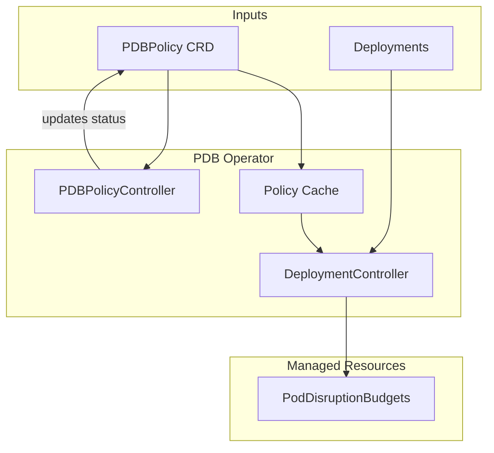

# Architecture

PDB Operator uses a **two-controller architecture** to manage PodDisruptionBudgets.

## Controllers

### PDBPolicyController

Watches `PDBPolicy` resources and:

- Finds matching deployments based on the policy's workload selector
- Updates policy status with the list of applied workloads and managed PDBs
- Handles policy deletion and cleanup via finalizers
- Invalidates the policy cache when policies change

### DeploymentController

Watches `Deployment` resources and:

- Resolves the effective policy for each deployment (considering annotations, enforcement modes, and priority)
- Creates, updates, or deletes PodDisruptionBudgets
- Removes PDBs entirely during active maintenance windows
- Detects and cleans up duplicate PDBs
- Manages finalizers for PDB cleanup on deployment deletion
- Records events and metrics for observability

## Reconciliation Flow

1. A `PDBPolicy` is created or updated
2. The PDBPolicyController finds all matching deployments
3. The DeploymentController picks up each deployment and resolves the effective policy
4. If the deployment has 2+ replicas, a PDB is created or updated
5. The PDB's `minAvailable` is set based on the availability class
6. During maintenance windows, PDBs are temporarily removed to allow disruptions
7. If a policy is deleted, managed PDBs are cleaned up via finalizers

## Key Design Decisions

- **Minimum 2 replicas:** PDBs are only created for deployments with 2+ replicas, since a PDB on a single-replica deployment would block all evictions
- **Priority-based resolution:** when multiple policies match a deployment, the highest priority policy wins
- **Finalizers:** ensure clean resource deletion when policies are removed
- **Policy caching:** reduces API calls during reconciliation for large clusters
- **Circuit breaker:** protects the Kubernetes API server from excessive calls during transient failures

## Related

- [Availability Classes](/docs/core-concepts/availability-classes): how `minAvailable` values are determined
- [Enforcement Modes](/docs/core-concepts/enforcement-modes): how the DeploymentController resolves overrides
- [Monitoring](/docs/guides/monitoring): metrics and tracing emitted by the controllers
