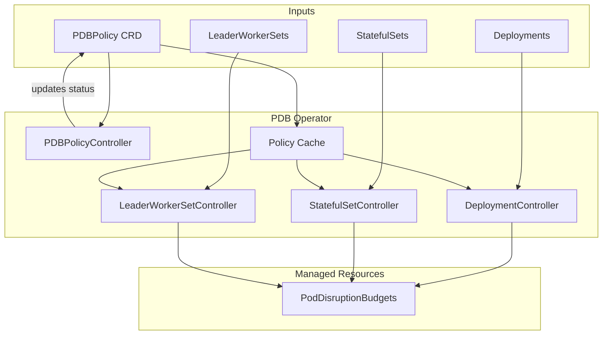

# Architecture

PDB Operator uses a **four-controller architecture** to manage PodDisruptionBudgets across every
supported workload kind.

```mermaid
graph TD
    subgraph inputs ["Inputs"]
        A["PDBPolicy CRD"]
        C["Deployments"]
        F["StatefulSets"]
        H["LeaderWorkerSets"]
    end

    subgraph operator ["PDB Operator"]
        B["PDBPolicyController"]
        D["DeploymentController"]
        G["StatefulSetController"]
        I["LeaderWorkerSetController"]
        Cache["Policy Cache"]
    end

    subgraph outputs ["Managed Resources"]
        E["PodDisruptionBudgets"]
    end

    A --> B
    B -->|updates status| A
    A --> Cache
    C --> D
    F --> G
    H --> I
    Cache --> D
    Cache --> G
    Cache --> I
    D --> E
    G --> E
    I --> E
```

## Controllers

### PDBPolicyController

Watches `PDBPolicy` resources and:

- Finds matching workloads based on the policy's workload selector
- Updates policy status with the list of applied workloads and managed PDBs
- Handles policy deletion and cleanup via finalizers
- Invalidates the policy cache when policies change

Status keys in `appliedToWorkloads` are `namespace/Kind/name`, so a Deployment and a StatefulSet
that share a name do not collide.

### DeploymentController

Watches `Deployment` resources and:

- Resolves the effective policy for each Deployment (considering annotations, enforcement modes, and priority)
- Creates, updates, or deletes PodDisruptionBudgets
- Removes PDBs entirely during active maintenance windows
- Detects and cleans up duplicate PDBs
- Manages finalizers for PDB cleanup on Deployment deletion
- Records events and metrics for observability

### StatefulSetController

Watches `StatefulSet` resources with the same policy-driven logic as the DeploymentController,
enabling PDB protection for stateful workloads such as databases and message queues.

It skips StatefulSets that LeaderWorkerSet creates internally (the leader and per-group worker
sets, identified by the `leaderworkerset.sigs.k8s.io/name` label) so that no pod is ever selected
by two managed PDBs, which would make the eviction API reject every eviction.

### LeaderWorkerSetController

Watches `LeaderWorkerSet` resources (`leaderworkerset.x-k8s.io/v1`) and quantizes the budget to
whole groups rather than individual pods. Support is detected at startup: without the LWS CRD
installed, this controller is not registered and the operator runs unchanged.

See [LeaderWorkerSet Support](./leaderworkerset.md) for the calculation and its
edge cases.

## Reconciliation Flow

1. A `PDBPolicy` is created or updated
2. The PDBPolicyController finds all matching workloads
3. The workload controller for that kind resolves the effective policy
4. If the workload has 2+ replicas, a PDB is created or updated
5. The PDB's `minAvailable` is set based on the availability class
6. During maintenance windows, PDBs are temporarily removed to allow disruptions
7. If a policy is deleted, managed PDBs are cleaned up via finalizers

## Key Design Decisions

- **Minimum 2 replicas:** PDBs are only created for workloads with 2+ replicas, since a PDB on a single-replica workload would block all evictions
- **Self-cleaning:** scaling below 2 replicas removes the PDB rather than orphaning it, and scaling back up recreates it
- **Priority-based resolution:** when multiple policies match a workload, the highest priority policy wins
- **One PDB per pod:** a pod must never match two managed PDBs, which is why LWS-internal StatefulSets are skipped
- **Finalizers:** ensure clean resource deletion when policies are removed
- **Policy caching:** reduces API calls during reconciliation for large clusters
- **Circuit breaker:** an internal, self-tuning wrapper around the Kubernetes client that protects the API server during transient failures. It is not configurable and emits no metrics

## Related

- [Availability Classes](/docs/core-concepts/availability-classes): how `minAvailable` values are determined
- [Enforcement Modes](/docs/core-concepts/enforcement-modes): how the workload controllers resolve overrides
- [LeaderWorkerSet Support](./leaderworkerset.md): group-aware budgets for multi-host inference
- [Monitoring](/docs/guides/monitoring): metrics and tracing emitted by the controllers
